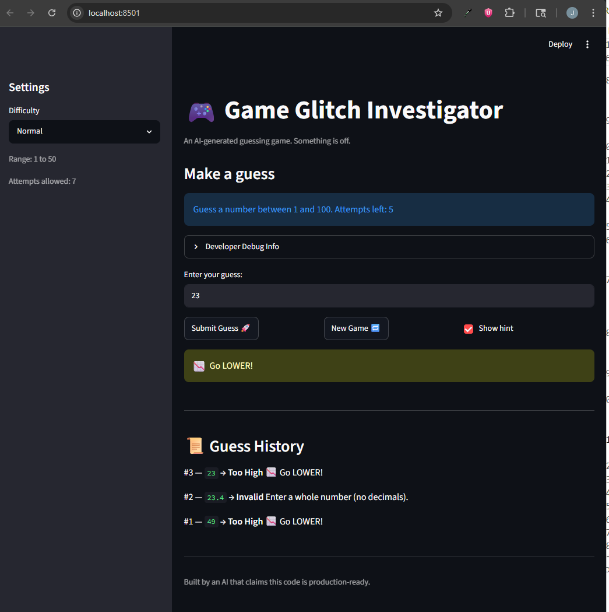

# 🎮 Game Glitch Investigator: The Impossible Guesser

## 🚨 The Situation

You asked an AI to build a simple "Number Guessing Game" using Streamlit.
It wrote the code, ran away, and now the game is unplayable. 

- You can't win.
- The hints lie to you.
- The secret number seems to have commitment issues.

## 🛠️ Setup

1. Install dependencies: `pip install -r requirements.txt`
2. Run the broken app: `python -m streamlit run app.py`

## 🕵️‍♂️ Your Mission

1. **Play the game.** Open the "Developer Debug Info" tab in the app to see the secret number. Try to win.
2. **Find the State Bug.** Why does the secret number change every time you click "Submit"? Ask ChatGPT: *"How do I keep a variable from resetting in Streamlit when I click a button?"*
3. **Fix the Logic.** The hints ("Higher/Lower") are wrong. Fix them.
4. **Refactor & Test.** - Move the logic into `logic_utils.py`.
   - Run `pytest` in your terminal.
   - Keep fixing until all tests pass!

## 📝 Document Your Experience

- [x] **Describe the game's purpose.**
-  A Streamlit number-guessing game where the player tries to guess a secret number within a limited number of attempts, with "higher/lower" hints and a score.

- [x] **Detail which bugs you found.**
1. Out-of-range guesses such as `-1` or `0` were accepted as valid and returned a misleading "Go LOWER" hint, even though the secret number is only ever within the difficulty's range such as 1 to 50.
2. On even-numbered attempts the secret was converted to a string before being compared, forcing an `int`/`str` mismatch in `check_guess` that fell back to lexicographic string comparison (e.g. `"9" > "50"`) and produced wrong hints.
3. The hint text was swapped: a guess that was too high said "Go HIGHER!" and a guess that was too low said "Go LOWER!", so guessing `1` told the player to go lower.

- [x] **Explain what fixes you applied.**
1. Added an `is_in_range(value, low, high)` helper and updated `parse_guess` to call it, rejecting any guess outside the inclusive `[low, high]` range with the message "Enter a number between {low} and {high}." This stops invalid guesses from reaching `check_guess` and producing false hints.
2. Hardened `check_guess` to always coerce `guess` and `secret` to `int` so comparisons are numeric, and removed the even-attempt `str(secret)` glitch so the secret is always passed as an integer.
3. Swapped the hint text to match the outcome: too high now says "📉 Go LOWER!" and too low says "📈 Go HIGHER!".


## 📸 Demo Walkthrough

Describe your fixed game in numbered steps so a reader can follow along without watching a video:

1. **Start the app.** Run `python -m streamlit run app.py` and pick a difficulty in the sidebar (Easy, Normal, or Hard). The sidebar should show a larger number range and fewer attempts as you select higher difficulty
2. **Make a guess.** Type a number into the input box and click "Submit Guess". The game validates your input first: when out-of-range numbers (e.g. `0` or `-1` when range is between 1 to 50) and decimals (e.g. `12.9`) are rejected with a clear message before they count as an attempt.
3. **Read the hint.** For a valid guess that isn't correct, the game tells you "Go HIGHER!" if you were too low or "Go LOWER!" if you were too high. The hints are now consistent on every attempt.
4. **Track your guesses.** Scroll to the "Guess History" panel to see every guess you've made this game (most recent first) with its outcome and hint.
5. **Win or run out of attempts.** Guess the secret number within the limited attempts to win (with a score based on how quickly you got it), or use up all your attempts to lose. Either way the game shows the secret and your final score.
6. **Start over.** Click "New Game 🔁" to fully reset with a fresh secret number, score back to 0, attempts cleared, and an empty history.

**Screenshot** *(optional)*: <!-- Insert a screenshot of your fixed, winning game here -->
 

## 🧪 Test Results

```
# Paste your pytest output here, e.g.:
# pytest tests/
# PS C:\Users\JohnP\Documents\GitHub\CodePath\ai110-module1show-gameglitchinvestigator-starter-main> python -m pytest tests/
============================================================================== test session starts ==============================================================================
platform win32 -- Python 3.13.5, pytest-9.0.3, pluggy-1.6.0
rootdir: C:\Users\JohnP\Documents\GitHub\CodePath\ai110-module1show-gameglitchinvestigator-starter-main
plugins: anyio-4.10.0
collected 20 items                                                                                                                                                               

tests\test_game_logic.py ....................                                                                                                                              [100%]

============================================================================== 20 passed in 0.03s ===============================================================================
PS C:\Users\JohnP\Documents\GitHub\CodePath\ai110-module1show-gameglitchinvestigator-starter-main> 
```

## 🚀 Stretch Features

- [x] **Guess History.** Added a "📜 Guess History" panel that lists every guess made in the current game (most recent first), showing the attempt number, the guessed value, the outcome (Win / Too High / Too Low / Invalid), and the hint message. Each guess is stored as a structured entry, and starting a new game clears the history, score, and status for a clean slate.
- [x] **Whole-number validation.** `parse_guess` now rejects decimal input (e.g. `12.9`) with the message "Enter a whole number (no decimals)." instead of silently flooring it, so only valid integer guesses are accepted.
